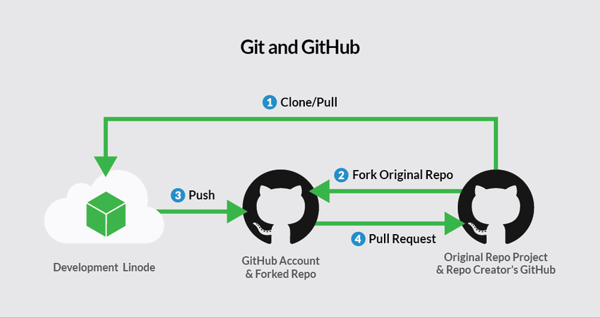

# BHL Git and GitHub Training

Welcome to BHL Git and GitHub training! 

If you are new to Git and GitHub, or you need a refresher, you're in the right place. 

In this training, you will upload a python script to `bentley-historical-library/bhl_git_training` repository (repo) and learn how to:
- [Fork and clone a repository](https://github.com/bentley-historical-library/bhl_git_training#step-1-setting-up) 
- [Pull, commit, push changes](https://github.com/bentley-historical-library/bhl_git_training#step-2-understanding-workflow)
- [Create pull requests](https://github.com/bentley-historical-library/bhl_git_training#step-3-collaborating)
- [Syncing your fork to the "upstream" repository](https://github.com/bentley-historical-library/bhl_git_training#step-4-syncing-to-upstream)

## BEFORE YOU START
- The 2024 reboot is adapted from Hyeeyoung Kim's original git training for the Bentley Historical Library. Thank you, Hyeeyoung!
- This training assumes you've successfully set up a Python [Development Environment](https://docs.google.com/document/d/1ov74wkiqkoGPJiiIfxrsJOEiWeXdjHd9ZyrKif4-ZdE/edit#heading=h.icnkahzf3tlr).
- I (Max) am a visual learner, and this visualization helped me get a basic overview of git and GitHub workflow:



## STEP 1. SETTING UP
### Forking a repo to your personal GitHub account
```
Click the Fork button in the top-right corner of a GitHub repo page
```
- A fork is a copy of a repo. Forking a repo allows you to freely experiment with changes without affecting the original project. [>> More](https://help.github.com/en/articles/fork-a-repo)

### Cloning a repo to your computer
```
Click File --> Clone repository... in the top-left corner of GitHub Desktop
Filter your repositories, choose a local path, and click Clone
```
- Cloning (from the command line, `git clone`) copies a from your fork to create a local copy on your computer. [>> More](https://www.atlassian.com/git/tutorials/setting-up-a-repository/git-clone)

## STEP 2. UNDERSTANDING WORKFLOW
### Syncing a fork
```
Click the Sync fork button in the top-right corner of your fork in GitHub, then Update branch
```
- This refreshes your fork so that it matches whats in the upstream repo (from the command line, `git fetch upstream`). It allows you to see what everybody else has been working on. [>> More](https://www.atlassian.com/git/tutorials/syncing/git-fetch)

### Fetching from fork
```
Click the Fetch origin button at the top of GitHub Desktop
```
- This ensures that what's local on your comuter matches what's in your fork. If there are differences, you will be prompted to "pull" (from the command line, `git pull`) them down. [>> More](https://www.atlassian.com/git/tutorials/syncing/git-pull)

### Committing new changes
```
Fill out the Title and optionally a Description in the lower left of GitHub Desktop and click Commit to master (sic)
```
- As you work on your computer, you save your work by committing it. Commits can be thought of as snapshots along the timeline of a project. Commits are created with the `git commit` command to capture the state of a project at that point in time. [>> More](https://www.atlassian.com/git/tutorials/saving-changes/git-commit)
- _Tip: Use the imperative mood for your commit message_

### Pushing new changes 
```
Click "Push origin" in GitHub Desktop (after committing a change)
```
- Pushing is used to upload what's local on your computer to your fork. [>> More](https://www.atlassian.com/git/tutorials/syncing/git-push)

## STEP 3. COLLABORATING 
### Creating Pull Requests
```
Click the Contribute button in the top right of GitHub and then the Open pull request button
Add a Title and optionally a Description
```
- Pull requests let you tell others about changes you have pushed to a repo on GitHub. Once the request is reviewed and approved, your changes are merged into the repo. [>> More](https://help.github.com/en/articles/about-pull-requests)
- _Tip: After creating a pull request and having it accepted, your fork will be technically behind the upstream repo. You'll need to start over again with syncing._

## BEFORE YOU LEAVE
That was the Git and GitHub basics! Before you leave, there are few *useful* things you might want to know:

### First and Foremost
```
When you are working with Git and GitHub, 
NEVER put confidential/senstive information 
(e.g., password, API keys, and etc.) into a repo.
```

### `.gitignore`
- A `.gitignore` file can be used to specify files and directories that should not be tracked by git. These might include log files, test data, configuration files created by a code editor, and so on.
- Files and directories to ignore can be specified by exact name (e.g., a directory named "test-data/" or a file called "secrets.txt") to ignore those specifics files or directories or by using a wildcard to ignore patters of files or directories (e.g., "*.log" to ignore all log files).
- [Learn more about .gitignore](http://swcarpentry.github.io/git-novice/06-ignore/index.html)

### `git status` and `git log`
```
git status
```
- The `git status` can be used to show which branch you are on, which files have uncommitted changes, whether or not your local repository is up-to-date with a remote repository, and so on.

```
git log
```
- The `git log` command can be used to list the commit history for your current branch or a specific file. Use `git log` to show all commits for the given branch and `git log filename` to show history for a specific file. [>> More about exploring your git history](http://swcarpentry.github.io/git-novice/05-history/index.html)

### Branching and Merging
```
git branch
```
- A git branch can be used to track a series of similar commits separate from the `master` branch. Branching is useful when you will be working on a specific feature request or issue that might require multiple commits or when working on multiple separate features at once to avoid committing too many conflicting changes to master. Use `git branch` to list all branches on your repository, `git branch [branch-name]` to create a new branch, and `git checkout [branch-name]` to switch to a specified branch.

```
git merge
```
- The `git merge` command can be used to combine (merge) the commits from a specified branch into your current branch. `git merge` will also report on conflicts that exist between the two branches, which will need to be resolved before the two branches can be combined. [>> More on branching and merging](https://git-scm.com/book/en/v2/Git-Branching-Basic-Branching-and-Merging)

## ADDITIONAL RESOURCE
- https://software-carpentry.org/lessons/
- https://guides.github.com/introduction/git-handbook
- https://www.atlassian.com/git/tutorials/
- https://realpython.com/python-git-github-intro/
- https://www.atlassian.com/git/tutorials/atlassian-git-cheatsheet

## ACKNOWLEDGMENTS
- This training resource was inspired by the GitHub Pages training, and each git command descriptions are from [GitHub Help](https://help.github.com), [Atlassian Git Tutorial](https://www.atlassian.com/git/tutorials), and [Software Carpentry](https://software-carpentry.org/lessons/index.html).
